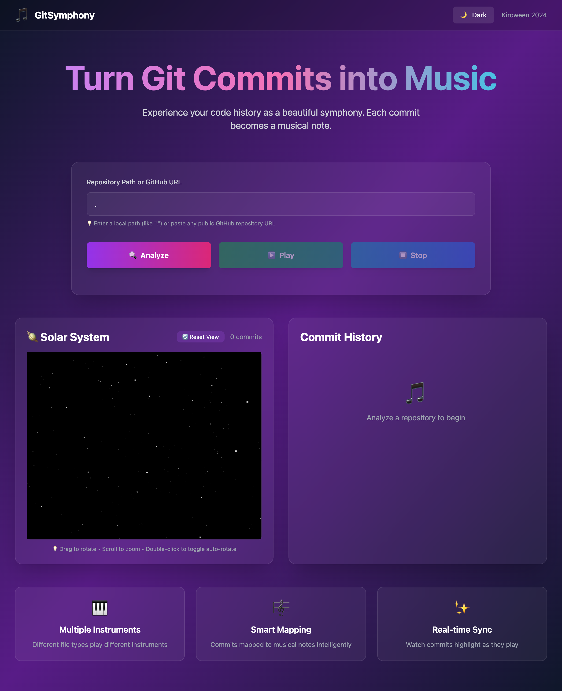
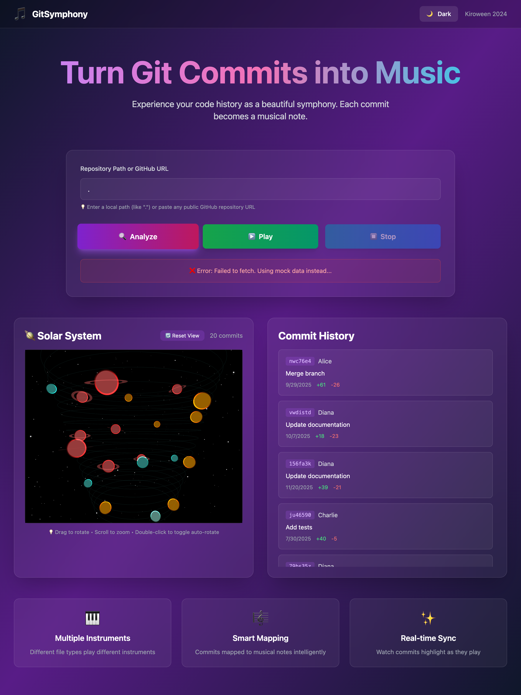
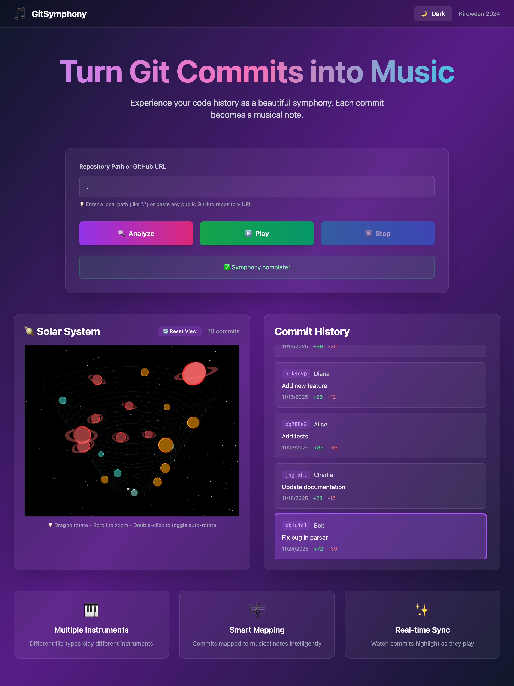
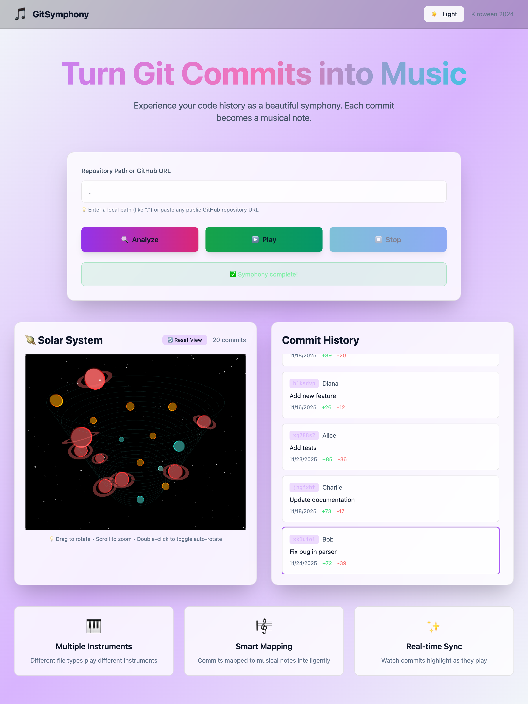

# 🎵 GitSymphony

> Transform your Git commit history into a beautiful symphony with 3D visualizations

[](https://kiroween.dev)
[](LICENSE)
[](https://nodejs.org)



## 🎃 Kiroween Hackathon - Frankenstein Category

GitSymphony combines three incompatible technologies into one harmonious experience:
- **Git** (version control) + **Web Audio API** (music generation) + **Three.js** (3D graphics)

## ✨ Features

### 🎵 Musical Mapping


- **Real git integration** - Analyzes actual repositories via backend API
- **Multiple instruments** - Different file types play different instruments:
  - JavaScript/TypeScript → Synth
  - Python/Java → Piano
  - Go/Rust → Bass
  - CSS/HTML/Markdown → Pluck
- **Intelligent note mapping**:
  - More additions → Higher pitch
  - Total changes → Note duration
  - Big commits (>100 changes) → Play chords
- **Pentatonic scale** - Always sounds musical

### 🌌 3D Visualization



- **Commit galaxy** - Each commit is a sphere in 3D space
- **Color coding**:
  - Red → Large commits (>100 changes)
  - Orange → Medium commits (>50 changes)
  - Cyan → Addition-heavy commits
  - Light cyan → Small changes
- **Spiral layout** - Commits arranged in a time-based spiral
- **Real-time highlighting** - Active commit pulses and scales up
- **Rotating camera** - Smooth orbital view

### 🎮 Interactive Controls

- 🔍 **Analyze** any local git repository or GitHub URL
- ▶️ **Play/Stop** your git symphony
- 📊 **Real-time sync** between audio and visual highlighting
- 🌓 **Dark/Light mode** toggle
- 🎨 **Interactive 3D** - Drag to rotate, scroll to zoom



## 🚀 Quick Start

```bash
# Clone the repository
git clone https://github.com/KHemanthRaju/gitsymphony.git
cd gitsymphony

# Install dependencies
npm install

# Run both frontend and backend
npm run dev:all
```

Open http://localhost:5174 in your browser and start analyzing repositories!

### Alternative: Run Separately

```bash
# Terminal 1 - Backend API (port 3001)
npm run server

# Terminal 2 - Frontend (port 5173)
npm run dev
```

### Try with Your Own Repository

1. Enter `.` to analyze the current directory
2. Or paste any public GitHub URL: `https://github.com/user/repo`
3. Click **Analyze** to load commits
4. Click **Play** to hear your git symphony!

## How It Works

1. **Analyze**: Backend API uses `simple-git` to parse repository history
2. **Map**: Converts commit data (additions, deletions, file types) to musical parameters
3. **Visualize**: Creates 3D representation using Three.js
4. **Play**: Generates audio using Tone.js with multiple instruments and highlights commits in real-time

## Mapping Algorithm

- **Pitch**: Based on lines added (more additions = higher notes)
- **Duration**: Based on total changes (more changes = longer notes)
- **Scale**: Pentatonic scale for pleasant harmonies

## Completed ✅

- [x] Backend API to parse real git repos
- [x] 3D visualization with Three.js
- [x] Multiple instrument tracks based on file types
- [x] Real-time commit highlighting
- [x] Chord generation for large commits
- [x] Color-coded commit visualization

## Next Steps

- [ ] Export to MIDI/MP3
- [ ] Live mode with git hooks (Kiro integration)
- [ ] Branch visualization
- [ ] Tempo control
- [ ] Multiple repo comparison
- [ ] Spec-driven development documentation

## 🛠️ Tech Stack

### Frontend
- **Vite** - Lightning-fast build tool
- **Tone.js** - Web Audio API framework for music generation
- **Three.js** - 3D graphics and visualization
- **Tailwind CSS** - Utility-first styling
- **shadcn/ui** - Beautiful UI components
- **Vanilla JavaScript** - No framework overhead

### Backend
- **Node.js + Express** - REST API server
- **simple-git** - Git repository parsing
- **CORS** - Cross-origin support

### Development Tools
- **Kiro AI** - AI-powered development assistant
- **Playwright** - Browser automation for screenshots
- **FFmpeg** - Video generation from screenshots

## 📹 Demo

Watch GitSymphony in action:

https://github.com/KHemanthRaju/gitsymphony/raw/main/screenshots/gitsymphony-demo.mp4

---

## 🎃 Kiroween 2024 Hackathon Submission

### Category: 👻 Frankenstein

**Incompatible Technologies Successfully Combined:**
- 🔧 **Git** - Version control system
- 🎵 **Web Audio API** - Real-time music generation
- 🌌 **Three.js** - 3D graphics rendering

### Kiro AI Features Utilized

This project was built with extensive use of Kiro AI's advanced features:

- ✅ **Vibe Coding** - Rapid prototyping and iterative development
- ✅ **Steering Documents** - Custom guidelines for music theory, project structure, and git analysis
- ✅ **Agent Hooks** - Automated testing and code quality checks on file save
- ✅ **Spec-Driven Development** - Structured feature planning with requirements, design, and tasks
- ✅ **Context Management** - Efficient use of #File, #Folder, and #Codebase references

**📖 See [KIRO_USAGE.md](./KIRO_USAGE.md) for detailed documentation of Kiro integration.**

### Project Links

- 🌐 **Repository:** [github.com/KHemanthRaju/gitsymphony](https://github.com/KHemanthRaju/gitsymphony)
- 📚 **Documentation:** [Quick Start Guide](./QUICKSTART.md) | [Deployment Guide](./DEPLOYMENT.md)
- 🎬 **Demo Video:** [screenshots/gitsymphony-demo.mp4](./screenshots/gitsymphony-demo.mp4)

---

## 📖 Documentation

- **[QUICKSTART.md](./QUICKSTART.md)** - Get started in 5 minutes
- **[KIRO_USAGE.md](./KIRO_USAGE.md)** - How Kiro AI was used to build this project
- **[DEPLOYMENT.md](./DEPLOYMENT.md)** - Deploy to Vercel and Railway
- **[screenshots/README.md](./screenshots/README.md)** - Media assets documentation

---

## 🤝 Contributing

Contributions are welcome! Feel free to:

1. Fork the repository
2. Create a feature branch (`git checkout -b feature/amazing-feature`)
3. Commit your changes (`git commit -m 'Add amazing feature'`)
4. Push to the branch (`git push origin feature/amazing-feature`)
5. Open a Pull Request

---

## 📄 License

This project is licensed under the MIT License - see the [LICENSE](./LICENSE) file for details.

---

## 🙏 Acknowledgments

- **Kiro AI Team** - For creating an amazing AI-powered development tool
- **Kiroween 2024** - For hosting this creative hackathon
- **Tone.js & Three.js Communities** - For excellent documentation and examples

---

<div align="center">

**Built with ❤️ and [Kiro AI](https://kiro.dev) for Kiroween 2024 🎃**

[⭐ Star this repo](https://github.com/KHemanthRaju/gitsymphony) | [🐛 Report Bug](https://github.com/KHemanthRaju/gitsymphony/issues) | [💡 Request Feature](https://github.com/KHemanthRaju/gitsymphony/issues)

</div>

## License
MIT License - See [LICENSE](./LICENSE) for details
